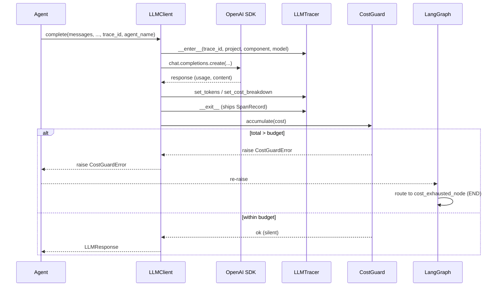

# Contract: `CostGuard` (Sprint 5)

**Module**: `autosentinel/llm/cost_guard.py`
**Exception**: `autosentinel/llm/errors.py::CostGuardError`
**State schema**: `data-model.md` §7 (`CostGuardState`)

---

## Public surface

```python
# autosentinel/llm/cost_guard.py
from decimal import Decimal
from threading import Lock

class CostGuard:
    def __init__(self, budget_limit: Decimal, currency: Currency = "CNY"): ...
    def accumulate(self, cost: Decimal, currency: Currency = "CNY") -> None:
        """
        Add cost to total_spent under lock. If the resulting total
        would, on the next call, push us above budget_limit, raise
        CostGuardError. Specifically: total_after_this + cost > budget
        is checked AFTER accumulating this call's cost.

        Same-currency only (Constitution VII.2): if `currency` != the guard's
        denomination, raise ValueError BEFORE mutating state — never a
        cross-currency add and never a silent skip (either would bypass the
        budget). No USD budget dimension is implemented in Sprint 5.
        """
    @property
    def state(self) -> CostGuardState: ...
    def reset_for_test(self) -> None:
        """Reset total_spent / call_count to zero. PYTEST_CURRENT_TEST gate."""

# Module-level singleton accessor:
def get_cost_guard() -> CostGuard: ...
```

`CostGuard` is **never instantiated directly** by agent code; agents resolve
the singleton via `get_cost_guard()`. The singleton is constructed lazily on
first access from `os.environ["AUTOSENTINEL_BUDGET_LIMIT_CNY"]` (default `"150"`),
denominated in CNY (all Sprint 5 models bill in CNY; no exchange conversion).

---

## Threshold semantics — exact wording

```text
INVARIANT (per call):
  Let `before` = state.total_spent   (Decimal, ≥ 0)
  Let `delta`  = cost                (Decimal, ≥ 0, this call)
  Let `limit`  = state.budget_limit  (Decimal, ≥ 0)

  Step 1 (accumulate):  before := before + delta
                        state.total_spent := before
                        state.call_count += 1
                        state.last_updated := now()
  Step 2 (check):       if before > limit:  raise CostGuardError(
                                                current_spent=before,
                                                attempted_amount=delta,
                                                budget_limit=limit)
```

- The **strict `>`** matters: a run that lands exactly at the budget does NOT
  trip the guard. There is no buffer.
- The error is raised **after** state is updated. The caller has already
  received the `LLMResponse`; the next outbound call is the one that fails
  fast (because it never even enters `complete()` — wait, no, it does, but
  the *previous* `accumulate()` already raised, and `complete()` re-checks
  via the `accumulate()` call after its own SDK return).
- **Practical effect**: the *N-th* call returns successfully but the *(N+1)-th*
  call's `accumulate()` raises **before** issuing any further SDK call after
  it (because `accumulate()` runs after each successful call, and the *N-th*
  call's `accumulate()` is where the raise happens — see sequence diagram).

---

## Sequence diagram



---

## `reset_for_test()` safety gate

```python
def reset_for_test(self) -> None:
    if not os.environ.get("PYTEST_CURRENT_TEST"):
        raise RuntimeError(
            "reset_for_test() may only be called from a pytest run. "
            "PYTEST_CURRENT_TEST env var was not set."
        )
    with self._lock:
        self._state = self._state.model_copy(update={
            "total_spent": Decimal("0"),
            "call_count": 0,
            "last_updated": None,
        })
```

- `PYTEST_CURRENT_TEST` is set automatically by pytest for the duration of a
  test; absent in production code paths.
- Tests are expected to call `reset_for_test()` from a fixture in `conftest.py`,
  not inline in each test body.

---

## Concurrency

- `threading.Lock` (sync stack — no `asyncio.Lock`).
- All public methods that read or mutate state acquire the lock.
- The `state` property returns a Pydantic `model_copy()` snapshot under lock,
  so callers never see torn reads.

---

## Test surface

`tests/unit/test_cost_guard.py` — five cases (minimum):

1. **Over-threshold raises**: budget = `Decimal("0.10")` CNY. `accumulate(0.06)` →
   ok. `accumulate(0.06)` → cumulative `0.12 > 0.10` → raises
   `CostGuardError(current_spent=0.12, attempted_amount=0.06, budget_limit=0.10, currency="CNY")`.
   Cost was already added to state before the raise.
2. **`reset_for_test()`**: with `PYTEST_CURRENT_TEST` set, after triggering
   case 1, calling `reset_for_test()` returns state to zeros and a subsequent
   `accumulate(0.05)` succeeds. Without `PYTEST_CURRENT_TEST` (delete temporarily),
   `reset_for_test()` raises `RuntimeError`.
3. **Threading-lock safety**: spawn 100 threads each calling `accumulate(0.001)`
   on a budget of `Decimal("100")`. After joining, `state.total_spent ==
   Decimal("0.100")` exactly (Decimal exact arithmetic, no race).
4. **Cross-currency is a hard error (VII.2)**: a CNY guard given a USD cost
   raises `ValueError` *before* mutating state — the CNY total and call_count
   are unchanged, and it is NOT a `CostGuardError` (no silent skip, no
   abort-bypass, no cross-currency add).
5. **Default budget**: `get_cost_guard()` with no env override yields a
   `Decimal("150")` CNY budget.

`tests/integration/test_cost_guard_pipeline.py` — pipeline behaviour:

6. **CostGuardError aborts before Verifier**: configure budget = `¥0.001`;
   inject a `MockLLMClient` returning `cost = ¥0.0005` per call; submit an
   incident through the full graph. After the first specialist's call, the
   second call (on SecurityReviewer) raises `CostGuardError`. Assert the
   pipeline ends in `cost_exhausted_node`, the Verifier is **not** invoked,
   `state["agent_trace"][-1] == "cost_guard_triggered"`, and
   `state["cost_accumulated"]` equals the cumulative `Decimal` snapshot.

---

## Trade-offs explicitly accepted

- **In-process state, lost on restart**: documented in `research.md` Decision 6.
  Single-process Sprint 5; restart implies a fresh run.
- **No per-agent quota**: documented in `plan.md` Block 2. Five LLM agents
  share one global budget. If SecurityReviewer alone consumes 80 % of cost
  (because reasoning model), that is fine — the system still aborts at the
  global ceiling.
- **Trust provider-reported tokens**: research.md residual-risk section.
  `tests/integration/test_cost_guard_pipeline.py` will additionally assert
  `summary.json.total_cost == sum(per_call.cost)` to catch SDK drift.
