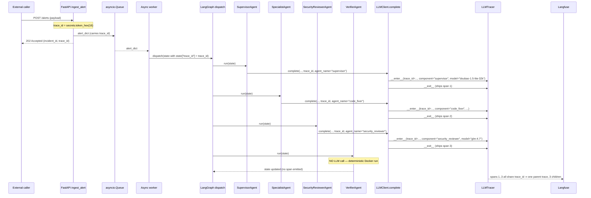

# Contract: Trace Propagation (Sprint 5)

**Originating constitution clause**: VII.3 (Trace Propagation Is Mandatory)
**Spec FRs**: FR-509, FR-510, FR-511, FR-512
**Project-4 LLMTracer**: `~/Repo/llmops-dashboard/src/llmops_dashboard/instrumentation/tracer.py`

---

## The four boundaries

| # | Boundary | Field name | Sync/async | Format |
|---|---|---|---|---|
| 1 | HTTP request → `ingest_alert` | (generated here) | async | `secrets.token_hex(16)` produces 32-char lowercase hex |
| 2 | `ingest_alert` → asyncio.Queue | `alert["trace_id"]` | async → async | string in payload dict |
| 3 | Worker → LangGraph dispatch | `state["trace_id"]` | async → sync | TypedDict field |
| 4 | Agent → `LLMClient.complete(...)` | `trace_id=...` keyword arg | sync | string passed to LLMTracer constructor |

The same string flows unchanged across all four boundaries. **Regeneration or
replacement at any boundary is a Constitution VII.3 violation.**

---

## Sequence diagram (full chain)



---

## Field name maps

### Boundary 1 (generation)

```python
# autosentinel/api/main.py — inside ingest_alert
import secrets
trace_id = secrets.token_hex(16)
# secrets.token_hex(16) returns 32 lowercase hex chars — exactly the LLMTracer regex.
```

### Boundary 2 (queue payload)

```python
alert_payload = {
    "incident_id": str(uuid.uuid4()),
    "trace_id": trace_id,
    # ... other fields ...
}
await alert_queue.put(alert_payload)
```

### Boundary 3 (LangGraph dispatch)

```python
# Inside the async worker
initial_state: AgentState = {
    "log_path": ...,
    # ... existing fields ...
    "trace_id": alert_payload["trace_id"],
}
graph.invoke(initial_state, config={"configurable": {"thread_id": alert_payload["incident_id"]}})
```

### Boundary 4 (agent → LLM client)

```python
# Inside DiagnosisAgent.run (and every other LLM-backed agent)
response = self._llm_client.complete(
    messages=messages,
    model=self._model_config.model,
    trace_id=state["trace_id"],   # mandatory — propagated unchanged
    agent_name="diagnosis",
    max_tokens=self._model_config.max_tokens,
    temperature=self._model_config.temperature,
)
```

---

## Validation rules

| Rule | Enforcement |
|---|---|
| `trace_id` shape `^[0-9a-f]{32}$` | `LLMRequest.trace_id` validator (data-model §2). Project-4 `LLMTracer.__init__` independently validates. |
| `trace_id` non-empty | Same regex rejects empty string. |
| `trace_id` unchanged across all 4 boundaries | Integration test below; no boundary regenerates. |
| Verifier emits **no** LLM span | Verifier is deterministic; absence verified by counting LLMTracer spans per trace. |
| Project tag `project="auto-sentinel"`, component tag = agent name | Hard-coded inside the concrete LLM client; verified by the Mock fixture asserting on `LLMTracer` constructor args. |

---

## Test surface

`tests/integration/test_trace_propagation.py` — three cases (minimum):

1. **`test_trace_id_end_to_end_consistency`**: feed a synthetic alert through
   the FastAPI endpoint with a `MockLLMClient` recording the `trace_id` of
   each `complete()` call. Assert that all 5 LLM-call agents observe the same
   `trace_id` and that this id matches the one returned by the ingest endpoint.

2. **`test_llmtracer_rejects_missing_trace_id`**: instantiate the real
   `ArkLLMClient` with `trace_id=""`. The wrapped `LLMTracer(trace_id="")`
   constructor raises `ValueError`; the client surfaces it (does **not** wrap).
   Assert via `pytest.raises(ValueError, match="32 lowercase hex")`.

3. **`test_state_serialization_preserves_trace_id`**: build an `AgentState`
   with a known `trace_id`, write it to PostgresSaver, read it back via the
   resume API, assert `state["trace_id"]` is byte-equal. (Requires the
   PostgresSaver container; the test is in the integration suite, not the
   unit suite.)

---

## Reference: project-4 LLMTracer interface

| What we use | Where (in project-4) | How (in Sprint 5) |
|---|---|---|
| `LLMTracer(trace_id=...)` constructor param | `tracer.py:51` (signature) + `tracer.py:65-74` (validation) | Always passed; concrete LLM clients open the tracer with `trace_id=request.trace_id`. |
| `trace_id` regex `^[0-9a-f]{32}$` | `tracer.py:16` | Mirror in `LLMRequest.trace_id` validator (data-model §2) so we fail at construction time, not at tracer-enter time. |
| `set_cost_breakdown(input_usd, output_usd)` | `tracer.py:102-110` | Concrete clients compute per-token costs from a hard-coded price table and call this method. `set_cost(total_usd)` is **not** used (deprecated). |
| Span shipped on `__exit__` | `tracer.py:131-166` | One `with LLMTracer(...) as t:` per `complete()` call; SDK call inside the block; tokens + cost set inside the block; tracer flushes the SpanRecord on exit. |

This contract is compatible with the project-4 PR-0 already merged. Any
future change to `LLMTracer`'s public interface is a cross-project
coordination issue, tracked in the dashboard repo, not here.
